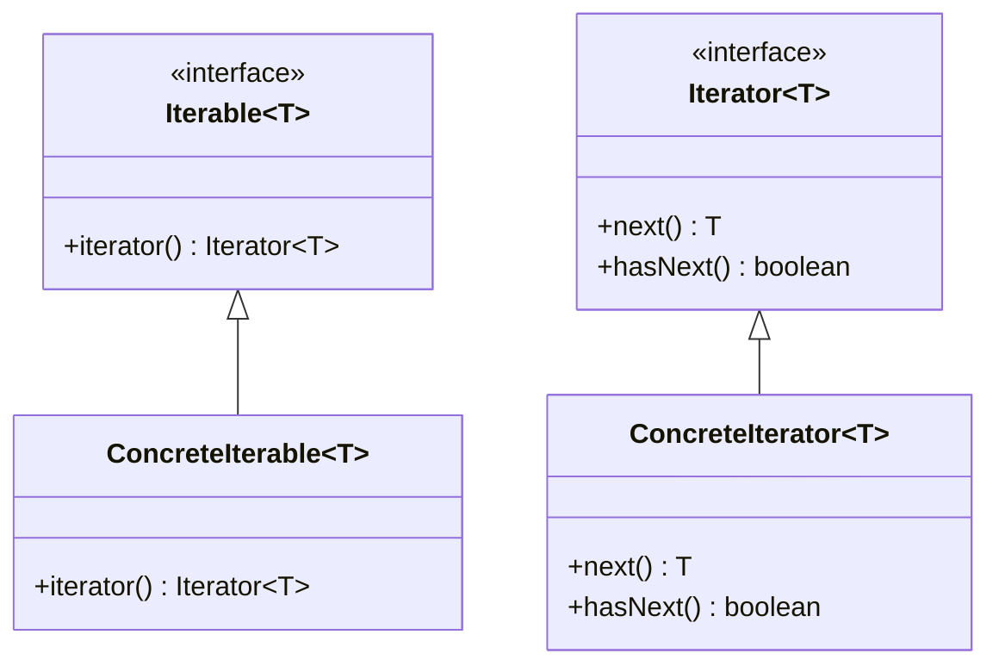
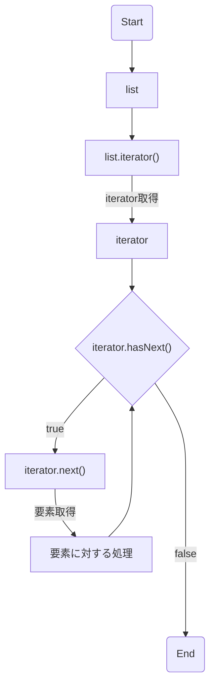

# 演習課題解説 その2

## 拡張for文とイテレータパターン

```Java
import java.util.List;

public class Main {
  public static void main(String[] args) {
    List<String> reverseList = new ReverseList<String>();
    reverseList.add("1");
    reverseList.add("2");
    reverseList.add("3");
    reverseList.add("4");
    reverseList.add("5");

    for (String element : reverseList) {
      System.out.println(element);
    }
  }
}
```

`ReverseList` を実装するにあたって、拡張for文に対応する必要があります。

```Java
for (String element : reverseList) {
  System.out.println(element);
}
```

拡張for文は `Iterable` を実装したインスタンスの中身を順に全件する取得するための構文です。

## イテレータパターンとは

イテレータパターンはGOFデザインパターンのひとつで、コレクション等の集合を表すクラスに対して中身を順に全件する取得する方法を提供するクラス設計手法です。

GOFデザインパターンとは、 `the Gang of Four` の異名を持つ4人が作り上げたクラス設計の見本集のことを言います。

- クラス図



- Listをiteratorで全件取得するフローチャート



* Listをiteratorで全件取得するコード

```Java
// forを使う場合
for (Iterator<String> iterator = list.iterator(); iterator.hasNext();) {
  String element = iterator.next();
  // 要素に対する処理
}

// whileを使う場合
Iterator<String> iterator = list.iterator();
while (iterator.hasNext()) {
  String element = iterator.next();
  // 要素に対する処理
}
```

なお、拡張for文にIterableを渡した場合、コンパイル時に上記の「forを使う場合」相当のコード（変数名がコンパイラ展開でしか使えない文字だったり、キャストがあったりするので多少異なります）に展開されます。

拡張for文はイテレータパターンをさらに使いやすくするために言語機能として追加されたシンタックスシュガーです。

このように優れたパターンは言語機能として追加されています。（ストラテジーパターンなど

## イテレータパターンのメリット

イテレータパターンを使わずにListの中身を列挙しようとすると以下のようなコードになると思います。

```Java
for (int i = 0; i < list.size(); i++) {
  T element = list.get(i);
  // 要素に対する処理
}
```

このコードを書くためには以下の知識が必要です。

- `List#size` で要素数が取得できる
- `List#get` で要素が取得できる
  - 要素のインデックスは0始まりである
  - 要素のインデックスは正の方向に1ずつ順に並んでいる

これらはそのクラスの実装によって異なります。

- 要素数取得は `size` か `count` か `length` か
  - それはメソッドかフィールドか
- 要素のインデックスは0始まりか1始まりか
- 要素のインデックスに飛びや重複はないか
- 要素のインデックスはマイナスでアクセスできるか

例えば、Stringクラスを列挙する場合（文字列は文字の集合）、Listと同じJavaの標準クラスであるにも関わらず以下のようにコードが異なります。

```Java
String string = "hoge";

for (int i = 0; i < string.length(); i++) {
  char element = string.charAt(i);
  // 要素に対する処理
}
```

---

日時はそれぞれどのように列挙すればよいでしょうか？

`2024-05-21T10:10:10+09:00`

`令和6年5月21日10時10分10秒`

2024年3月10日（日曜日）の24時間を列挙するとどうなるでしょうか？

---

集合を列挙するという極めてよく書くコードにも関わらず、利用者が注意しないとバグが混入しやすいことがわかったと思います。

そこで、クラスの実装者が列挙する方法も実装するというのがイテレータパターンです。
クラスの利用者は細かい列挙の方法を調べることなく、イテレータに対して要素の取得と次の要素があるかの確認を行えばよくなります。

## イテレータパターンの実装

逆順で列挙するイテレータを実装するのであれば以下のようなコードになるでしょう。

```Java
import java.util.ArrayList;
import java.util.Iterator;

public class ReverseList<T> extends ArrayList<T> {
  @Override
  public Iterator<T> iterator() {
    return new ReverseListIterator<T>(this);
  }
}

class ReverseListIterator<T> implements Iterator<T> {
  private final ArrayList<T> list;
  private int index;

  public ReverseListIterator(List<T> list) {
    this.list = list;
    this.index = list.size();
  }

  @Override
  public boolean hasNext() {
    return index > 0;
  }

  @Override
  public T next() {
    this.index--;
    return this.list.get(this.index);
  }
}
```
