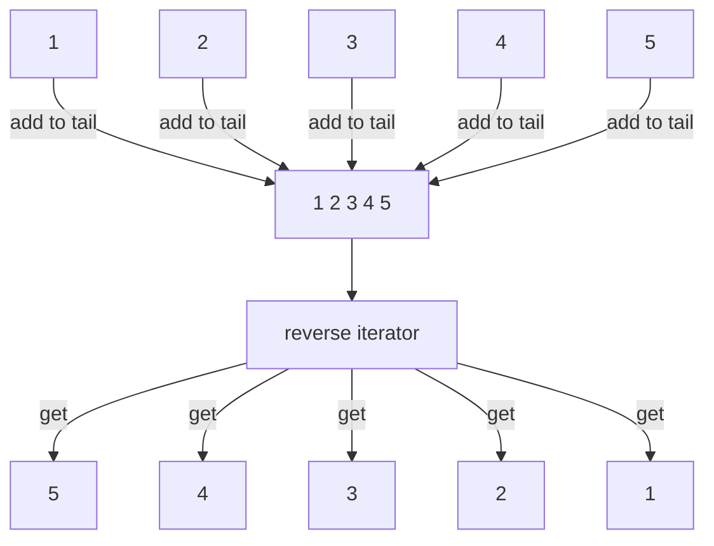
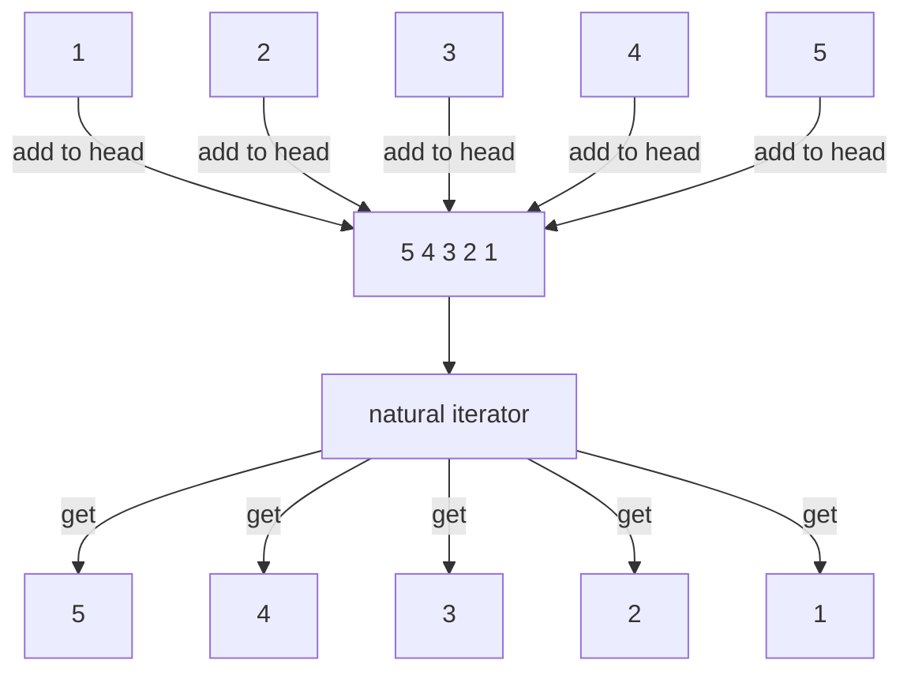

# 演習課題解説 その3

## カプセル化

```Java
import java.util.List;

public class Main {
  public static void main(String[] args) {
    List<String> reverseList = new ReverseList<String>();
    reverseList.add("1");
    reverseList.add("2");
    reverseList.add("3");
    reverseList.add("4");
    reverseList.add("5");

    for (String element : reverseList) {
      System.out.println(element);
    }
  }
}
```

前章では「listから逆順で要素を取り出す」方法について考えました。
他方、逆順でソートされたリストの実装方法としては「リストに要素を追加する際に逆順で追加する」方法も考えられます。

* そのまま追加し逆順で返す方法



* 逆順で追加しそのまま返す方法



これらは内部実装が異なりますが振る舞いは同じです。

## 情報隠蔽

外部仕様を公開し、内部実装を隠蔽する設計手法を情報隠蔽といい、カプセル化と並ぶもの・またはカプセル化の一部として捉えられています。
内部実装が隠蔽されることで、利用者にとっては必要な知識が減るという、実装者にとっては仕様を変えなければ内部実装を変更できるというメリットがあります。

---

構造や原理を知らないけれども使用方法を知っていれば使えるものには何があるでしょうか？

---
