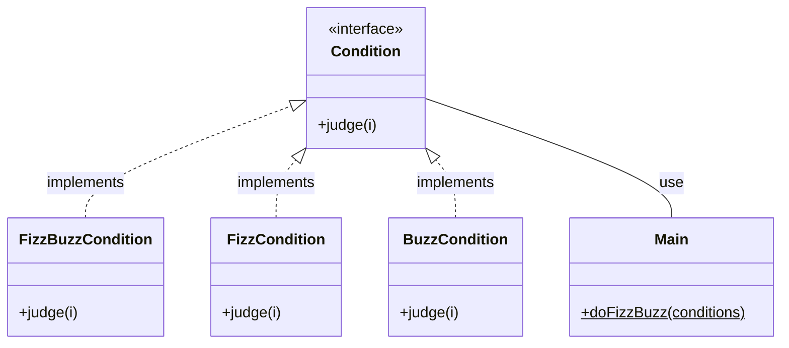
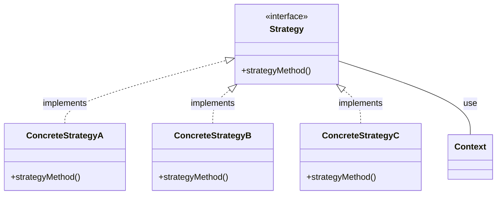

# Java Stream API 特講 第一章 ~ メソッドの受渡しとStrategyパターン

## 本講義の目的

この講義は、スッキリJavaではあまり触れられていないStream API及びJavaにおける関数志向のプログラミング機能を説明します。


## メソッドは非第一級オブジェクト

Javaにおいてメソッドは第一級オブジェクトではありません。

これはメソッドは変数に代入することができず、メソッドに引数として渡したり、メソッドから返り値として戻したりすることができないことを意味します。

```java
// 値（プリミティブ型はその値・オブジェクト型は参照の値）は変数に代入できる
String number = "10";

// 値はメソッドの引数に渡せるし、メソッドの返り値で返せる
int parsed = Integer.parseInt(number);

// compile error
// Javaではメソッドそのものを変数に代入することはできない
Method method = Integer.parseInt;
```

なお、メソッドや関数が第一級オブジェクトである言語も存在します。


## メソッドを受渡ししたい場合

前述の通り、Javaではメソッド自体をメソッドに渡すことができませんが、それによる不都合が生じることがあります。

例えば以下はごく一般的なFizzBuzzです。

```java
public class Main {
  public static void main(String[] args) {
    doFizzBuzz();
  }

  public static void doFizzBuzz() {
    for (var i = 1; i <= 100; i++) {
      if (i % 15 == 0) {
        System.out.println("FizzBuzz");
      } else if (i % 3 == 0) {
        System.out.println("Fizz");
      } else if (i % 5 == 0) {
        System.out.println("Buzz");
      } else {
        System.out.println(i);
      }
    }
  }
}
```

しかし、これは全ての値がハードコーディングされていて柔軟性がありません。

そこでこれを `Fizz` ・ `Buzz` の条件を何の倍数にするかを引数で受け取れるようにすると以下のようになるでしょう。

```java
public class Main {
  public static void main(String[] args) {
    // LinkedHashMapは順序を維持できる
    // 倍数と表示名のペア
    LinkedHashMap<Integer, String> multiplierNamePairs = new LinkedHashMap<>();
    multiplierNamePairs.put(15, "FizzBuzz");
    multiplierNamePairs.put(3, "Fizz");
    multiplierNamePairs.put(5, "Buzz");

    doFizzBuzz(multiplierNamePairs);
  }

  // ラベル付きbreakを使った謎の実装
  public static void doFizzBuzz(LinkedHashMap<Integer, String> multiplierNamePairs) {
    for (var i = 1; i <= 100; i++) {
      CONDITION: {
        for (Map.Entry<Integer, String> multiplierNamePair : multiplierNamePairs.entrySet()) {
          if (i % multiplierNamePair.getKey() == 0) {
            // 条件に当てはまったら表示してCONDITIONのブロック自体を抜ける
            System.out.println(multiplierNamePair.getValue());
            break CONDITION;
          }
        }

        // いずれの条件にも当てはまらなかったらその数字を表示する
        System.out.println(i);
      }
    }
  }
}
```

これで「何の倍数の時に」という条件は柔軟に運用できるようになりました。

しかし、倍数以外での条件は依然として受け取ることができません。

これをより柔軟に運用するためには、 `if (i % condition.multiply == 0)` の条件式そのものが欲しいのです。

要するに「int型の値を受け取ってbooleanの値を返す判定メソッド」を引数で受け取りたいのですが、前述の通りメソッドそのものは引数で受渡しできません。

他方、Javaにおいてインスタンスはメソッドの引数で受渡しできる上、インスタンスはインスタンスメソッドを持つため、メソッドをインスタンスに包んで渡せば良いと考えられます。

その例がこちらです。

```java
// 条件を表すinterface
interface Condition {
  boolean judge(int i);
}

// 受け取ったint値が15で割り切れる時はFizzBuzz
class FizzBuzzCondition implements Condition {
  @Override
  public boolean judge(int i) {
    return i % 15 == 0;
  }
}

// 受け取ったint値が3で割り切れる時はFizz
class FizzCondition implements Condition {
  @Override
  public boolean judge(int i) {
    return i % 3 == 0;
  }
}

// 受け取ったint値が5で割り切れる時はBuzz
class BuzzCondition implements Condition {
  @Override
  public boolean judge(int i) {
    return i % 5 == 0;
  }
}
  
public class Main {
  public static void main(String[] args) {
    // LinkedHashMapは順序を維持できる
    // 条件と表示名のペア
    LinkedHashMap<Condition, String> conditionNamePairs = new LinkedHashMap<>();
    conditionNamePairs.put(new FizzBuzzCondition(), "FizzBuzz");
    conditionNamePairs.put(new FizzCondition(), "Fizz");
    conditionNamePairs.put(new BuzzCondition(), "Buzz");

    doFizzBuzz(conditionNamePairs);
  }

  // ラベル付きbreakを使った謎の実装
  public static void doFizzBuzz(LinkedHashMap<Condition, String> conditionNamePairs) {
    for (var i = 1; i <= 100; i++) {
      CONDITION: {
        for (Map.Entry<Condition, String> conditionNamePair : conditionNamePairs.entrySet()) {
          // Condition型のjudgeメソッドを呼び出す
          // そのインスタンスの実装クラスによって挙動が異なる（ポリモフィズム
          if (conditionNamePair.getKey().judge(i)) {
            // 条件に当てはまったら表示してCONDITIONのブロック自体を抜ける
            System.out.println(conditionNamePair.getValue());
            break CONDITION;
          }
        }

        // いずれの条件にも当てはまらなかったらその数字を表示する
        System.out.println(i);
      }
    }
  }
}
```

`Condition` interfaceを実装した条件判定メソッドを持つインスタンスを受け渡すことで柔軟に条件判定することができるようになりました。

これで、例えば「数字に `3` が含まれるときだけ・・・」とか「数字が2桁のときだけ・・・」というような条件も簡単に追加できます。

```java
class ContainsThreeCondition implements Condition {
  @Override
  public boolean judge(int i) {
    return Integer.toString(i).contains("3");
  }
}

class TowDigitsCondition implements Condition {
  @Override
  public boolean judge(int i) {
    return 10 <= i && i <= 99;
  }
}

// こんなのも必要になるかもしれない
class AlwaysTrueCondition implements Condition {
  @Override
  public boolean judge(int _i) {
    return true;
  }
}
```


## Strategyパターン

これまでの実装をクラス図に表すと以下の通りです。



そして、これはGOFのStrategyパターンそのものです。



このように、従来Javaではメソッドを受け渡したい時には

1. interfaceを定義する
1. そのinterfaceを実装したclassを定義し、それに渡したいメソッドを実装する
1. そのclassをnewして引数に渡す

という段階を踏んできました。

---

次章以降ではlambda式・メソッド参照・Stream APIについて解説します。

lambda式・メソッド参照はStrategyパターンを簡単に実装する方法であり、Stream APIはStrategyパターンを活用したコレクション操作の組み込みクラスであるため、これらの根底にあるStrategyパターンの理解は不可欠です。

Strategyパターンの理解を固めてから進むか、進んでわからなくなったらここに戻ってくるのが良いでしょう。

---
